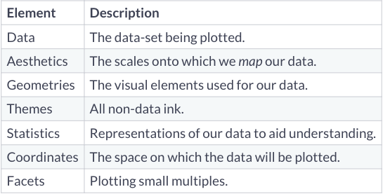
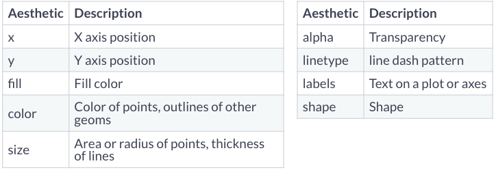

# Data Visualization with ggplot2
ggplot2 is based on the grammar of graphics, the
idea that you can build every graph from the same
few components: a data set, a set of geoms—visual
marks that represent data points, and a coordinate
system

### Package and imported data
```{r warning=FALSE, message=FALSE}
# install.packages('ggplot2')
library(ggplot2)
```

```{r warning=FALSE, message=FALSE}
library(readr)
nba_position <- read_csv("~/Desktop/Microsoft/DataVisualization/nba_player_position.csv")
nba_players <- read_csv("~/Desktop/Microsoft/DataVisualization/nba_raw_players.csv")
nba_id_players <- read_csv("~/Desktop/Microsoft/DataVisualization/nba_id_players.csv")
```

### Elements of graph


##### Layer(層)
* Data：使用什麼資料
* Mapping：使用資料裡什麼變數
* Statistical transformation (stat)： 需不需要對變數先做統計轉換
* Geometric object (geom)：要畫什麼幾何圖形（點、線等等）
* Position adjustment (position)：幾何圖形位置調整

##### Scale(刻度尺)
##### Coordinate system (座標系統)
##### Faceting (多圖面)
#### canvas of ggplot
`ggplot()`會製造出一張空白畫布，供我們疊加更多圖層。 
```{r}
ggplot(nba_position, aes(HEIGHT, WEIGHT))
```


### Data Preprocessing
```{r}
nba_position$POSITION[nba_position$POSITION == "Forward-Center"] <- "Center-Forward"
nba_position$POSITION[nba_position$POSITION == "Guard-Forward"] <- "Forward-Guard"
```

選出 LeBron James 的生涯數據資料：
```{r warning=FALSE, message=FALSE}
library(dplyr)
LeBron_ID <- nba_id_players[which(nba_id_players$Name=='LeBron James'),]$id
LeBron <- filter(nba_players, PLAYER_ID==LeBron_ID)
show(LeBron)
```

選出 Dwyane Wade 的生涯數據資料：
```{r warning=FALSE, message=FALSE}
Wade_ID <- nba_id_players[which(nba_id_players$Name=='Dwyane Wade'),]$id
Dwyane <- filter(nba_players, PLAYER_ID==Wade_ID & TEAM_ABBREVIATION != 'TOT')
show(Dwyane)
```

將賽季切分成兩個年份，以賽季開始年份為主：
```{r}
library(tidyr)
LeBron <- LeBron %>% separate(SEASON_ID, 
                              c("YEAR", "REST"))
Dwyane <- Dwyane %>% separate(SEASON_ID, 
                              c("YEAR", "REST"))
```


### Aesthetics
ggplot2 當中用來美化視覺化結果的 mapping，例如設定顏色、形狀、透明度、大小等等，更多用法可見 [Aesthetic specifications](https://cran.r-project.org/web/packages/ggplot2/vignettes/ggplot2-specs.html).



```{r}
ggplot(nba_position, aes(HEIGHT, WEIGHT))+
  geom_point()
```

#### Color, Alpha, Shape, ...
```{r}
ggplot(nba_position, aes(HEIGHT, 
                         WEIGHT, 
                         color = POSITION, 
                         alpha = 0.3,
                         shape = POSITION
                         # size = ...
                         ))+
  geom_point()
```

### Basic Graphs
Use a geom to represent data points, use the geom’s aesthetic properties to represent variables. Each function returns a layer.

#### Line Plot
* 同一個主題
* 呈現趨勢與變化
* 時間序列資料
```{r}
ggplot(LeBron, aes(as.numeric(YEAR), PTS)) + 
  geom_line()
```

可以利用`geom_line`、`geom_ribbon`等來使得視覺化結果更能傳達意思，同時使用`lab()`來更改主標題、x/y軸標題。

```{r}
ggplot(LeBron, aes(as.numeric(YEAR), PTS)) + 
  geom_line(color='blue')+
  geom_hline(yintercept = 2000, color="red", linetype="dashed")+
  geom_ribbon(aes(ymin = 2000, ymax=PTS), fill = 'grey')+
  labs(title="LeBron James' overall Points", x='Season', y='Points')
```


#### Scatter Plot
* 兩個變數
* 呈現兩變數間的關係
* 正相關、負相關等等

```{r}
ggplot(nba_position, aes(HEIGHT, 
                         WEIGHT, 
                         color = POSITION, 
                         alpha = 0.3,
                         shape = POSITION
                         # size = ...
                         ))+
  geom_point(position = 'jitter')
```

可以透過`geom_point(position = 'jitter)'`或是`geom_jitter()`來讓資料點更加分散，達到較好的呈現結果。

```{r}
ggplot(sample_n(nba_position, 500), aes(HEIGHT, 
                                        WEIGHT, 
                                        color = POSITION, 
                                        alpha = 0.8, 
                                        shape = POSITION
                                        # size = ...
                                        ))+
  geom_jitter()
```

可以使用`guides()`來選擇圖例所要顯示的內容，或是是否要顯示顏色、形狀等：

```{r}
ggplot(nba_position, aes(HEIGHT, 
                         WEIGHT, 
                         color = 'blue', 
                         alpha = 0.3,
                         shape = POSITION
                         # size = ...
                         ))+
  geom_point(position = 'jitter')+
  guides(
         colour = "none",
         shape = "legend", 
         alpha=FALSE
         )
```


#### Histogram
* 同一個主題
* 呈現數值分佈
* 表達連續性資料

使用1單位身高作為每個bin的涵蓋區間：
```{r}
ggplot(nba_position, aes(x=HEIGHT)) + 
  geom_histogram(binwidth=1)
```

將不同位置分開，繪製histogram結合密度圖density plot以及標註平均值，可以看出不同位置之間的分布差異：

```{r warning=FALSE, message=FALSE}
library(plyr)
mu <- ddply(nba_position, "POSITION", summarise, grp.mean=mean(HEIGHT))
ggplot(nba_position, aes(x=HEIGHT, color=POSITION)) +
geom_histogram(aes(y=..density..), position="identity", alpha=0.5, binwidth = 1)+
geom_density(alpha=0.6)+
geom_vline(data=mu, aes(xintercept=grp.mean, color=POSITION),
             linetype="dashed")
```


#### Bar Chart
* 一組數值資料
* 呈現數量分布
* 表達類別型資料

繪製 LeBron 歷年的比賽場數資料，並依照所屬球隊上色：
```{r}
ggplot(LeBron, aes(as.numeric(YEAR), GP, fill=TEAM_ABBREVIATION)) + 
  geom_bar(stat = "identity") + 
  xlab('SEASON')
```

繪製 Dwyane 歷年的比賽場數資料，並依照所屬球隊上色：
```{r}
ggplot(Dwyane, aes(as.numeric(YEAR), GP, fill=TEAM_ABBREVIATION)) + 
  geom_bar(position = "dodge", stat = "identity") + 
  xlab('SEASON')
```
繪製不同位置的球員數量長條圖：
```{r}
Position_cnt <- as.data.frame(table(nba_position$POSITION))
colnames(Position_cnt)<-c("Position", "Count")
ggplot(Position_cnt, aes(Position, Count, fill=Position)) + 
  geom_bar(stat = "identity")
```

#### Box Plot
* 同一個主題
* 呈現資料的分佈
* 類別之間的分佈差異
```{r}
ggplot(nba_position, aes(POSITION, WEIGHT, color=POSITION))+
  geom_boxplot()
```
使用 violin plot 也有類似效果：
```{r}
ggplot(nba_position, aes(POSITION, WEIGHT, color=POSITION))+
  geom_violin(scale = 'area')
```

### Themes
可以設置途中 line, rect, text, title, aspect.ratio, axis, legend, panel, plot, strip...etc.的樣式，舉例來說設定圖標題置中：
```{r}
ggplot(LeBron, aes(as.numeric(YEAR), PTS)) + 
  geom_line(color='blue')+
  geom_hline(yintercept = 2000, color="red", linetype="dashed")+
  geom_ribbon(aes(ymin = 2000, ymax=PTS), fill = 'grey')+
  labs(title="LeBron James' overall Points", x='Season', y='Points')+
  theme(plot.title = element_text(hjust = 0.5))
```
或是將主題換成classic：
```{r}
ggplot(LeBron, aes(as.numeric(YEAR), PTS)) + 
  geom_line(color='blue')+
  geom_hline(yintercept = 2000, color="red", linetype="dashed")+
  geom_ribbon(aes(ymin = 2000, ymax=PTS), fill = 'grey')+
  labs(title="LeBron James' overall Points", x='Season', y='Points')+
  theme_classic()
```

### Statistics
Some plots visualize a transformation of the original data set. Use a stat to choose a common transformation to visualize. 意即繪圖前是否需要進行統計上的轉換、或是繪製統計圖：

```{r}
ggplot(nba_position, aes(HEIGHT, WEIGHT))+
  geom_point(position='jitter', aes(color = POSITION))+
#  geom_smooth()
  stat_smooth(method = "auto", formula = y ~ x)
```

```{r}
ggplot(Dwyane, aes(GP, PTS))+
  geom_point()+
  stat_quantile()
```

### Scales
可以去更改資料對應到`aes`時的對應方式，如將顏色改成連續的漸層色：
```{r}
ggplot(Dwyane, aes(GP, PTS, color = PF))+
  geom_point()+
  scale_color_distiller()
```

或是specify要呈現在圖上的資料類別、對應的顏色、還有呈現在圖例上的名稱等：

```{r}
ggplot(sample_n(nba_position, 500), aes(HEIGHT, 
                                        WEIGHT, 
                                        color = POSITION 
                                        # alpha = 0.8, 
                                        # shape = POSITION
                                        # size = ...
                                        ))+
  geom_jitter()+
  scale_color_manual(
    limits=c("Center","Forward","Guard"), # 哪些原始資料值可被視覺化？
    values=c("blue","red","green"), # 各別原始值對應的視覺呈現
    ### 定義刻度尺說明（即guide/legend）
    name="Position", # 刻度尺名稱
    breaks=c("Center","Forward","Guard"), # 哪些原始值要顯現？
    labels=c("C","F","G") # 那些原始值的標籤名稱。
  )
```

### Coordinates
可以更改視覺化結果的座標系統，以達到更好的視覺呈現：
```{r}
ggplot(Position_cnt, aes(Position, Count, fill=Position)) + 
  geom_bar(stat = "identity")+
  coord_polar(theta = "x", direction=1 )
```

```{r}
ggplot(Position_cnt, aes(Position, Count, fill=Position)) + 
  geom_bar(stat = "identity")+
  coord_flip()
```

### Facets
如果想要將圖片切成子圖時，可以使用`facet_grid()`來處理切割的依據：
```{r}
ggplot(nba_position, aes(HEIGHT, WEIGHT, color = POSITION))+
  geom_point(position='jitter')+
  facet_grid(POSITION ~ .)
```


